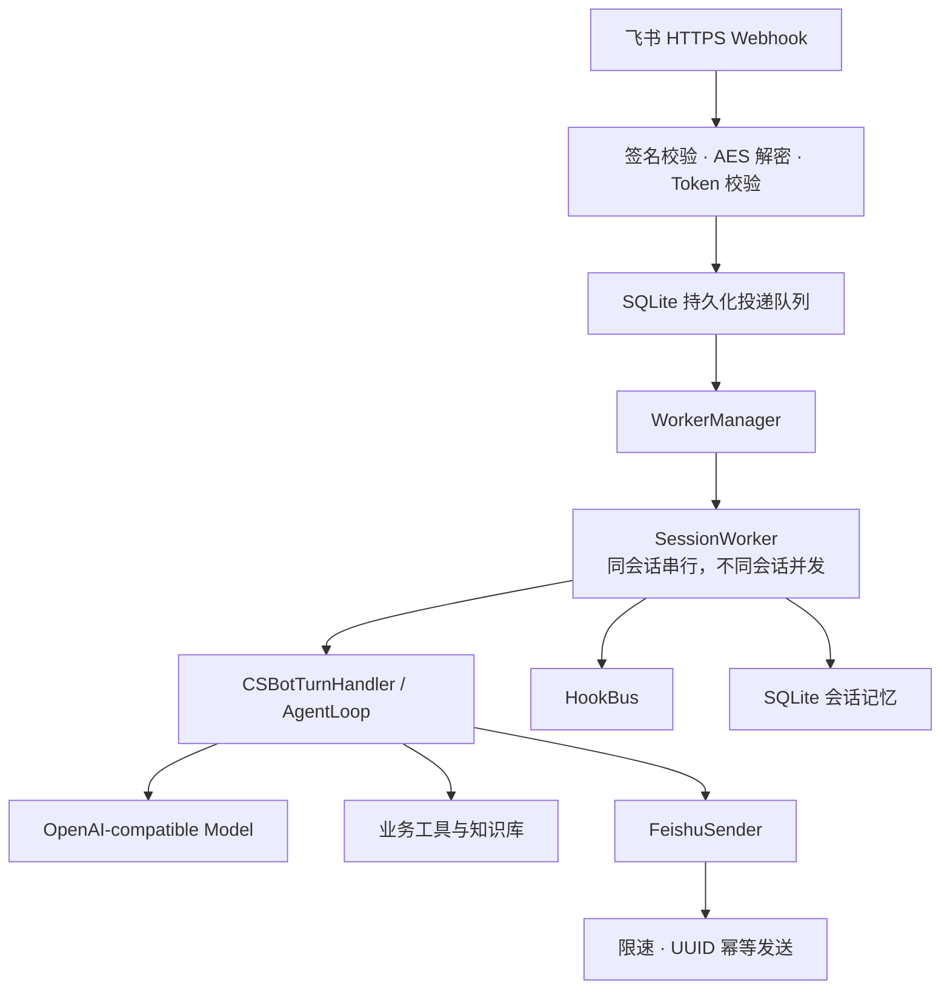

# Kitty

Kitty 提供会话 worker、模型编排、工具与 hook、持久化记忆，以及可真实部署的飞书消息链路。

## 架构



## 核心能力

- 每个会话独立串行 worker，不同会话并发执行；
- SQLite 持久化会话、消息幂等记录和飞书投递任务；
- 飞书请求签名、AES-256-CBC 解密和 Verification Token 校验；
- 回调先落盘再确认，失败指数退避，服务重启后继续处理；
- 使用飞书 `uuid` 防止网络重试产生重复回复；
- OpenAI-compatible 模型接口和本地确定性 mock 模式；
- 工具 allowlist、超时隔离和结构化错误；
- `/health`、`/ready`、Docker 和生产配置强校验。

## 仓库结构
```text
.
├── kitty-runtime/       # Kitty 兼容运行时、飞书服务、测试与部署文件
├── csbot/               # 参考业务 Agent：工具、知识库、SOP 和飞书集成
├── cs_agent/            # CS-bot 的 SQLite 数据辅助模块
├── main.py              # 组装真实 CS-bot 的 bootstrap 入口
├── AGENTS.md            # Agent 工作约束
└── MEMORY.md            # 项目级长期上下文示例
```

## 本地运行
Python 3.11 或更高版本
```bash
cd kitty-runtime
python3 -m venv .venv
.venv/bin/pip install -r requirements.lock
.venv/bin/pip install --no-deps -e .
.venv/bin/python -m kitty --once "hello"
```
未配置模型密钥时，开发环境默认使用 mock provider，不会发起外部请求。

## 飞书生产运行
```bash
cp kitty-runtime/.env.production.example .env.production
# 填入真实模型、飞书和多维表配置
set -a
source .env.production
set +a
kitty-runtime/.venv/bin/uvicorn kitty.server:create_app \
  --factory --app-dir kitty-runtime --host 0.0.0.0 --port 8000
```

飞书事件订阅地址：

```text
https://你的域名/feishu/events
```

详细配置见 [飞书生产部署指南](kitty-runtime/docs/production-deployment.md)。

## Docker
```bash
docker build -t kitty -f kitty-runtime/Dockerfile .
docker run --rm -p 8000:8000 \
  --env-file .env.production \
  -v kitty-data:/data/kitty \
  kitty
```
当前持久化层为 SQLite，生产环境应保持单实例。横向扩容前需要将会话和投递队列迁移到共享存储。

## 测试
```bash
cd kitty-runtime
.venv/bin/python -m unittest discover -s tests -v
```
当前测试覆盖 worker 并发、会话恢复、工具与 hook 隔离、飞书加密事件、持久化投递、失败重试、UUID 幂等发送和真实 CS-bot 启动。

## 文档
- [运行时详细说明](kitty-runtime/README.md)
- [系统架构](kitty-runtime/docs/architecture.md)
- [事件协议](kitty-runtime/docs/event-protocol.md)
- [CS-bot 兼容边界](kitty-runtime/docs/csbot-compatibility.md)
- [飞书生产部署](kitty-runtime/docs/production-deployment.md)
