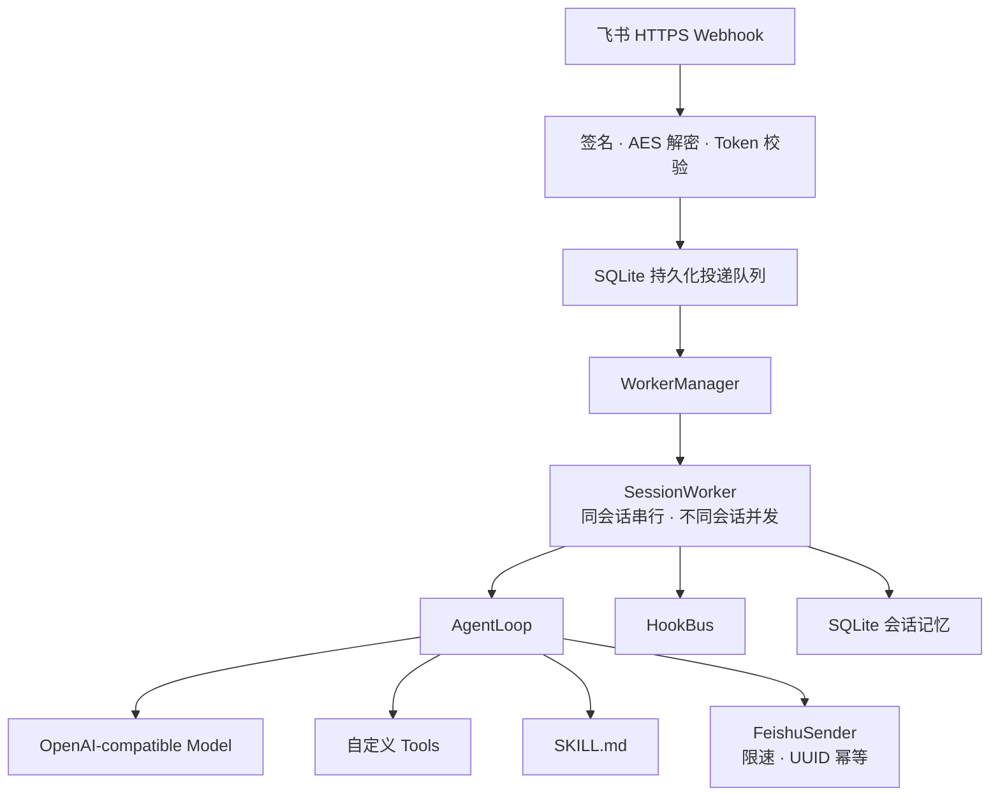

# Kitty

Kitty 是一个通用、可部署的飞书 AI 机器人运行时，不绑定任何具体业务。

它负责飞书事件安全、会话并发、模型调用、工具扩展、Hook、持久化投递和运维；你的机器人业务通过系统提示词、工具模块、Skills 和 Hooks 注入。

## 架构



## 核心能力

- 飞书请求签名、AES-256-CBC 解密和 Verification Token 校验；
- 回调先落盘再确认，失败指数退避，重启后恢复未完成任务；
- 每个会话独立串行 worker，不同会话并发；
- OpenAI-compatible Chat Completions 模型接口；
- Python 工具模块、`SKILL.md` 和事件 Hook 扩展；
- SQLite 会话历史、事件去重、投递状态和死信重放；
- 飞书发送限速和稳定 `uuid`，避免网络重试重复回复；
- `/health`、`/ready`、生产配置校验和 Docker 部署。

## 快速开始

```bash
git clone https://github.com/jocelynzhang0812-lab/kitty.git
cd kitty/kitty-runtime
python3 -m venv .venv
.venv/bin/pip install -r requirements.lock
.venv/bin/pip install --no-deps -e .
.venv/bin/python -m kitty --once "hello"
```

开发环境未配置模型密钥时使用本地 mock provider，不会访问外部服务。

## 扩展机器人能力

工具模块只需导出同步函数 `register_tools(registry)`：

```python
from kitty.tools.registry import ToolRegistry


def register_tools(registry: ToolRegistry) -> None:
    registry.add(
        "add",
        lambda a, b: a + b,
        description="Add two numbers.",
        parameters={
            "type": "object",
            "properties": {
                "a": {"type": "number"},
                "b": {"type": "number"},
            },
            "required": ["a", "b"],
        },
    )
```

生产环境通过逗号分隔的模块名加载：

```text
KITTY_TOOL_MODULES=examples.tools,my_bot.tools
KITTY_HOOK_PATHS=examples/echo_hook.py,my_bot/audit_hook.py
KITTY_SYSTEM_PROMPT=You are our internal Feishu assistant.
```

## 飞书生产运行

```bash
cp kitty-runtime/.env.production.example .env.production
# 填写真实模型和飞书应用配置
docker build -t kitty -f kitty-runtime/Dockerfile .
docker run --rm -p 8000:8000 \
  --env-file .env.production \
  -v kitty-data:/data/kitty \
  kitty
```

飞书事件订阅地址：

```text
https://你的域名/feishu/events
```

完整步骤见[飞书生产部署指南](kitty-runtime/docs/production-deployment.md)。

## 仓库结构

```text
.
└── kitty-runtime/
    ├── kitty/          # 运行时源码
    ├── examples/       # 中性工具与 Hook 示例
    ├── tests/          # 单元和集成测试
    ├── docs/           # 架构、事件协议和部署指南
    ├── Dockerfile
    └── pyproject.toml
```

## 测试

```bash
cd kitty-runtime
.venv/bin/python -m unittest discover -s tests -v
```

当前 SQLite 部署模式面向单实例。需要横向扩容时，应把会话和投递队列替换为共享存储。
