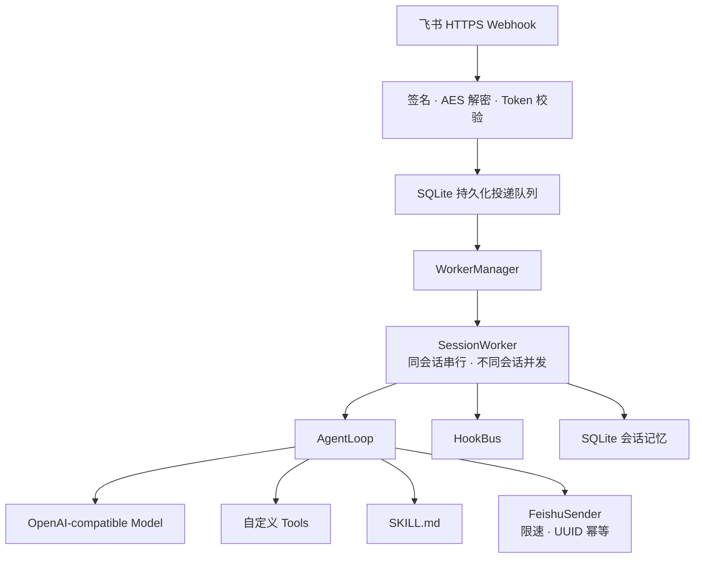
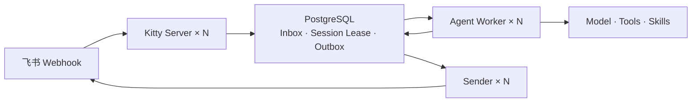

# Kitty

Kitty 是一个通用、可部署的飞书 AI 机器人，负责飞书事件安全、会话并发、模型调用、工具扩展、Hook、持久化投递和运维；
你的机器人业务通过系统提示词、工具模块、Skills 和 Hooks 注入。

## 架构

Kitty 同时支持两种部署模式：单进程 SQLite 适合快速上线，分布式 PostgreSQL 模式适合独立扩容。



分布式模式把职责拆成三个独立进程：



## 核心能力

- 飞书请求签名、AES-256-CBC 解密和 Verification Token 校验；
- 回调先落盘再确认，失败指数退避，重启后恢复未完成任务；
- 每个会话独立串行 worker，不同会话并发；
- OpenAI-compatible Chat Completions 模型接口；
- Python 工具模块、`SKILL.md` 和事件 Hook 扩展；
- SQLite 会话历史、事件去重、投递状态和死信重放；
- 飞书发送限速和稳定 `uuid`，避免网络重试重复回复；
- 交互式消息卡片：卡片构建器（文本/按钮/下拉）、`card.action.trigger` 回调走同一条持久投递链路、表情回应与卡片原地更新；
- 图片消息：`FEISHU_ACCEPT_IMAGES=1` 开启接收（`image_key` 暴露给工具/Hook），支持资源下载、图片上传与发送；
- `/health`、`/ready`、生产配置校验和 Docker 部署。
- PostgreSQL 分布式 Inbox/Outbox、Session Lease、fencing token 和独立 Server/Worker/Sender 扩容。

## 快速开始

```bash
git clone https://github.com/jocelynzhang0812-lab/kitty.git
cd kitty/kitty-runtime
python3 -m venv .venv
.venv/bin/pip install -r requirements.lock
.venv/bin/pip install --no-deps -e .
.venv/bin/kitty setup
```

浏览器向导会依次完成机器人设定、模型连接、飞书连接和上线检测，密钥只写入本机权限为 `0600` 的 `.env`。全部检查通过后：

```bash
.venv/bin/kitty serve --env-file .env
```

把向导生成的 `https://你的域名/feishu/events` 粘贴到飞书事件订阅页即可。详细时间表见[10 分钟上线指南](kitty-runtime/docs/ten-minute-launch.md)。

仅体验本地对话时，可以运行 `.venv/bin/python -m kitty --once "hello"`；未配置模型密钥会使用本地 mock provider。

## 扩展机器人能力

工具模块只需导出同步函数 `register_tools(registry)`：

```python
from kitty.tools.registry import ToolRegistry


def add(a: float, b: float) -> float:
    return a + b


def register_tools(registry: ToolRegistry) -> None:
    registry.add(
        "add",
        add,
        description="Add two numbers.",
        parameters={
            "type": "object",
            "properties": {
                "a": {"type": "number"},
                "b": {"type": "number"},
            },
            "required": ["a", "b"],
        },
    )
```

生产环境通过逗号分隔的模块名加载：

```text
KITTY_TOOL_MODULES=examples.tools,my_bot.tools
KITTY_HOOK_PATHS=examples/echo_hook.py,my_bot/audit_hook.py
KITTY_SYSTEM_PROMPT=You are our internal Feishu assistant.
```

Worker 可以把工具放到独立 Python 子进程执行：

```text
KITTY_TOOL_EXECUTOR=subprocess
KITTY_TOOL_MAX_OUTPUT_BYTES=65536
KITTY_TOOL_DENYLIST=dangerous_tool
```

使用 subprocess 模式时，工具 handler 必须是可导入函数；如果使用 lambda 或闭包，需要在 `registry.add(..., handler_ref="module:function")` 中显式提供导入路径。

更严格的生产隔离可以切到容器执行：

```text
KITTY_TOOL_EXECUTOR=container
KITTY_TOOL_CONTAINER_IMAGE=kitty-runtime:latest
KITTY_TOOL_CONTAINER_NETWORK=none
KITTY_TOOL_CONTAINER_MEMORY=256m
KITTY_TOOL_CONTAINER_CPUS=1
```

容器模式会使用短生命周期 Docker 容器执行工具，默认无网络、只读根文件系统、丢弃 Linux capabilities，并设置进程数、CPU、内存和 tmpfs 限制。

## 飞书生产运行

推荐先运行向导：

```bash
cd kitty-runtime
.venv/bin/kitty setup
.venv/bin/kitty doctor --env-file .env --live
.venv/bin/kitty serve --env-file .env
```

需要容器部署时，也可以使用生成的 `.env`：

```bash
cp kitty-runtime/.env.production.example .env.production
# 填写真实模型和飞书应用配置
docker build -t kitty -f kitty-runtime/Dockerfile .
docker run --rm -p 8000:8000 \
  --env-file kitty-runtime/.env \
  -v kitty-data:/data/kitty \
  kitty
```

飞书事件订阅地址：

```text
https://你的域名/feishu/events
```

完整步骤见[10 分钟上线指南](kitty-runtime/docs/ten-minute-launch.md)和[飞书生产部署指南](kitty-runtime/docs/production-deployment.md)。

## 分布式运行

```bash
cp kitty-runtime/.env.server.example kitty-runtime/.env.server
cp kitty-runtime/.env.worker.example kitty-runtime/.env.worker
cp kitty-runtime/.env.sender.example kitty-runtime/.env.sender
# 分角色填写真实配置，Worker 不会获得飞书密钥
docker compose -f docker-compose.distributed.yml up --build -d
docker compose -f docker-compose.distributed.yml up -d --scale worker=4 --scale sender=2
```

在分布式模式下，Server 只验签、落盘和确认；Agent Worker 只运行模型与工具；Sender 只发送飞书消息。发送失败不会重新运行 Agent。完整说明见[分布式部署指南](kitty-runtime/docs/distributed-deployment.md)。

## 仓库结构

```text
.
└── kitty-runtime/
    ├── kitty/          # 运行时源码
    ├── examples/       # 中性工具与 Hook 示例
    ├── tests/          # 单元和集成测试
    ├── docs/           # 架构、事件协议和部署指南
    ├── Dockerfile
    └── pyproject.toml
```

## 测试

```bash
cd kitty-runtime
.venv/bin/python -m unittest discover -s tests -v
```

SQLite 模式保持向后兼容并面向单实例；需要横向扩容时使用 PostgreSQL 分布式模式。
